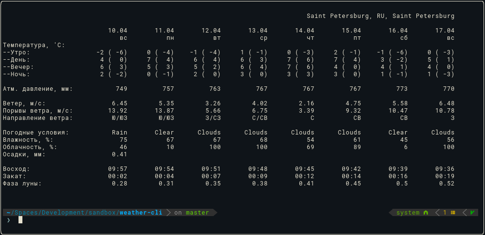
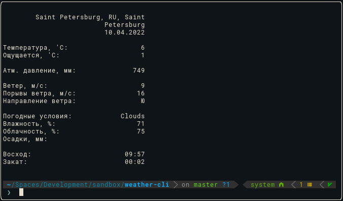

# weather-cli

<div align="center">
  <h3>Погода на неделю</h3>
  
</div>

<div align="center">
  <h3>Текущая погда</h3>
  
</div>

## Установка

```
npm install -g @ihvoshchevskij/weather-cli
```

Для работы приложения необходим токен для доступа к OpenWeather api
https://openweathermap.org/full-price#current

## Использование

```
weather [<city>] [<options>]
```

## Опции

```
 -d, --daily              Показать погоду на неделю
 -h, --help               Показать справочную информацию
 -v, --version            Показать версию приложения
 -t, --set-token          Сохранить токен для доступа к OpenWeather api
 -c, --set-city           Сохранить город в качестве города по умолчанию
 -l, --list-of-cities     Показать список последних просмотренных городов
```

## Примеры использования

```
weather
```

При первом запуске приложения необходимо будет ввести токен для доступа к OpenWeather api, а также указать город, который будет использоваться по умолчанию

```
weather -t
weather -t <token>
```

Перезапишет текущий токен

```
weather -c
weather -c <city>
```

Перезапишет город, используемый по умолчанию

```
weather
weather -d
```

Покажет текущую погоду или погоду на следующие 7 дней для города, сохраненного в качестве города по умолчанию

```
weather <city>
weather <city> -d
```

Покажет текущую погоду или погоду на следующие 7 дней для указанного города.
Город будет добавлен в список последних просмотренных городов

```
weather -l
weather -ld
```

Отобразит список последних просмотренных городов, с возможностью показа прогноза погоды для выбронного из этого списка города

```
weather -h
```

Отоброзит справочную информацию

```
weather -v
```

Отобразит версию приложения

## Формат ввода городов

```
weather moscow
weather Москва
weather Санкт Петербург
```
